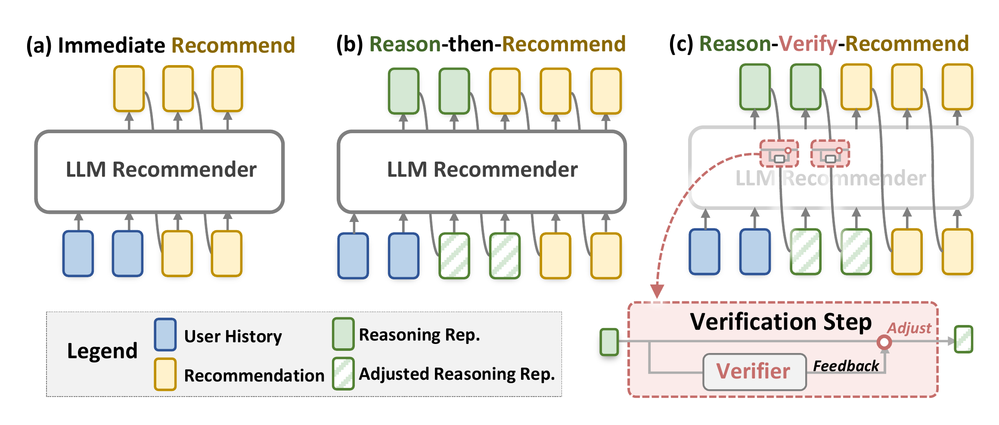

# VRec

This repository contains the PyTorch implementation of our paper (SIGIR'26)
> **Verifiable Reasoning for LLM-based Generative Recommendation**
>
> Xinyu Lin<sup>12</sup>, Hanqing Zeng<sup>1</sup>, Hanchao Yu<sup>1</sup>, Yinglong Xia<sup>1</sup>, Jiang Zhang<sup>1</sup>, Aashu Singh<sup>1</sup>, Fei Liu<sup>1</sup>, Wenjie Wang<sup>2</sup>, Fuli Feng<sup>2</sup>, Tat-Seng Chua<sup>2</sup>, Qifan Wang<sup>1</sup>
>
> <sup>1</sup>Meta Modern Recommendation System (MRS)  <sup>2</sup>National University of Singapore
>
> Correspondence: Xinyu Lin ([xylin1028@gmail.com](mailto:xylin1028@gmail.com)), Qifan Wang ([wqfcr@meta.com](mailto:wqfcr@meta.com))

The code runs the full pipeline on the ``MicroLens`` dataset with ``Qwen2.5-1.5B``.

---
## Overview

<p align="center">
  
</p>

<p align="center"><i>Comparison of (a) typical LLM-based recommendation, (b) reasoning for LLM-based recommendation, and (c) our proposed verifiable reasoning (Reason-Verify-Recommend) paradigm.</i></p>

---
## Environment
- **Python** 3.9 / 3.10 / 3.11 (not 3.12)
- **PyTorch** 2.1.0 (CUDA 12.1)
- **Transformers** 4.46.3
- **NumPy** < 2

```bash
cd code
python3.10 -m venv .venv
source .venv/bin/activate
pip install torch==2.1.0 --index-url https://download.pytorch.org/whl/cu121
pip install "transformers==4.46.3" "numpy==1.26.4" \
            datasets pandas tqdm fire ipdb accelerate sentencepiece protobuf
```

Download the base ``Qwen2.5-1.5B`` and pass its path via ``BASE_QWEN``:

```bash
huggingface-cli download Qwen/Qwen2.5-1.5B --local-dir ./Qwen2.5-1.5B
```

---
## Data
The data for ``MicroLens`` is provided under ``./data/MicroLens/`` for reproduction:

- ``train/`` , ``valid/`` , ``test/`` — user interaction sequences (CSV)
- ``info/`` — item title list (``MicroLens.txt``) and the two verifier label files
  (``*_asin2cat_qwen_cluster_25.npy`` = category, ``*_asin2cat_cf_cluster_25.npy`` = CF cluster)
- ``1T/`` — auxiliary reasoning files

Nothing needs to be prepared.

---
## Training & Inference
The pipeline has **three training stages**, followed by inference and metric computation.

| # | Stage | Code | Model class |
|---|---|---|---|
| 1 | LLM Rec pre-training | ``src/pretrain_LLM/train.py`` | ``LatentModel_MS`` |
| 2 | Verifier pre-training (MoV, LLM frozen) | ``src/pretrain_verifier/train.py`` | ``LatentModelwithVerifier_RATT_MS_MoV`` |
| 3 | Verifiable reasoning fine-tuning | ``src/finetune/train.py`` | ``LatentModelwithVerifier_RATT_MS_MoV`` |
|   | Inference | ``src/finetune/eval.py`` | |
|   | Metrics (NDCG / HR) | ``src/utils/calc.py`` | |

All stages are wired together by ``scripts/run_single.sh``, which runs them in order and
prints NDCG@[1,3,5,10,20] / HR@[1,3,5,10,20] at the end. Logs and checkpoints are saved
under ``./output_dir/``.

```bash
BASE_QWEN=./Qwen2.5-1.5B bash scripts/run_single.sh <dataset>      # e.g. MicroLens
```

Options (environment variables):

| variable | default | meaning |
|---|---|---|
| `BASE_QWEN` | – | path to the base Qwen2.5-1.5B model |
| `N_THOUGHT` | `1` | number of latent reasoning steps |
| `SAMPLE` | `-1` | `-1` = full data; a positive N subsamples N rows |
| `SKIP_PRETRAIN` / `SKIP_VERIFIER` | `0` | `1` = reuse existing stage-1/2 checkpoints and resume at fine-tuning |

For a quick check before a full run (small subsample, runs end-to-end in minutes):

```bash
SAMPLE=64 BASE_QWEN=./Qwen2.5-1.5B bash scripts/run_single.sh MicroLens
```

---
## Multi-GPU Training

For single-node multi-GPU (data-parallel) training, run `scripts/run.sh` instead of
`scripts/run_single.sh`. It launches every training stage with
`torchrun --nnodes=1 --nproc_per_node=${nn}`, and each `train.py` hands the model to Hugging Face
`Trainer`, which wraps it in `DistributedDataParallel` across the `nn` GPUs. `nn` (default `8`) is set
at the top of the script — edit it to match your machine's GPU count.

```bash
bash scripts/run.sh MicroLens
```
